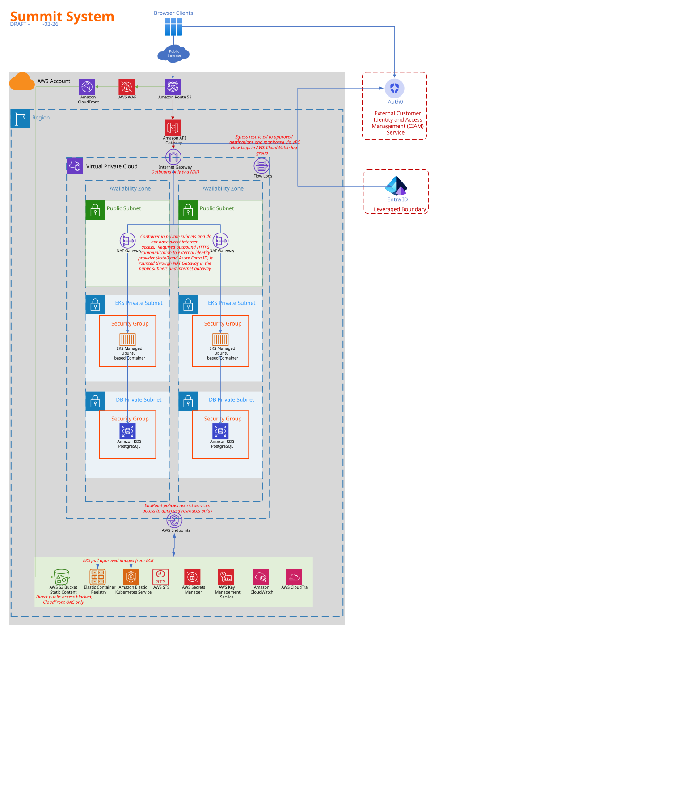

# Summit — Model Office Example

**Organization:** Oscalate Systems  
**System Name:** Summit

## Overview

Summit is a representative model office system created by Oscalate Systems to serve as a high-quality example of a complete compliance package expressed in [OSCAL](https://pages.nist.gov/OSCAL/). This example demonstrates how all seven OSCAL models work together to document and assess the security posture of an information system.

## Technical Architecture



## OSCAL Models

Summit includes complete example artifacts for all seven OSCAL models, representing the full lifecycle from control definition through assessment and remediation:

| # | Model | Directory | Description |
|---|-------|-----------|-------------|
| 1 | **Catalog** | [`catalog/`](catalog/) | Security control catalog defining available controls |
| 2 | **Profile** | [`profile/`](profile/) | Baseline selection and tailoring of controls |
| 3 | **Component Definition** | [`component-definition/`](component-definition/) | Security capabilities of individual system components |
| 4 | **System Security Plan (SSP)** | [`system-security-plan/`](system-security-plan/) | Comprehensive system security documentation |
| 5 | **Assessment Plan (SAP)** | [`assessment-plan/`](assessment-plan/) | Plan for assessing security controls |
| 6 | **Assessment Results (SAR)** | [`assessment-results/`](assessment-results/) | Findings from security assessments |
| 7 | **POA&M** | [`poam/`](poam/) | Plan of Action & Milestones for remediation tracking |

## Model Relationships

The seven OSCAL models form a connected workflow:

```
Catalog ──► Profile ──► SSP ──► SAP ──► SAR ──► POA&M
                         ▲                        │
                         │                        │
               Component ┘              (feeds back into SSP)
              Definitions
```

1. **Catalog** defines the universe of available controls
2. **Profile** selects and tailors controls from the catalog into a baseline
3. **Component Definitions** describe how components implement controls
4. **SSP** documents the system and how controls are implemented (importing both the profile and component definitions)
5. **AP** defines the plan for assessing the controls documented in the SSP
6. **AR** captures findings and evidence from the assessment
7. **POA&M** tracks remediation of identified weaknesses, feeding back improvements to the SSP

## File Format

All examples in this library are provided in **JSON** (`.oscal.json`).
