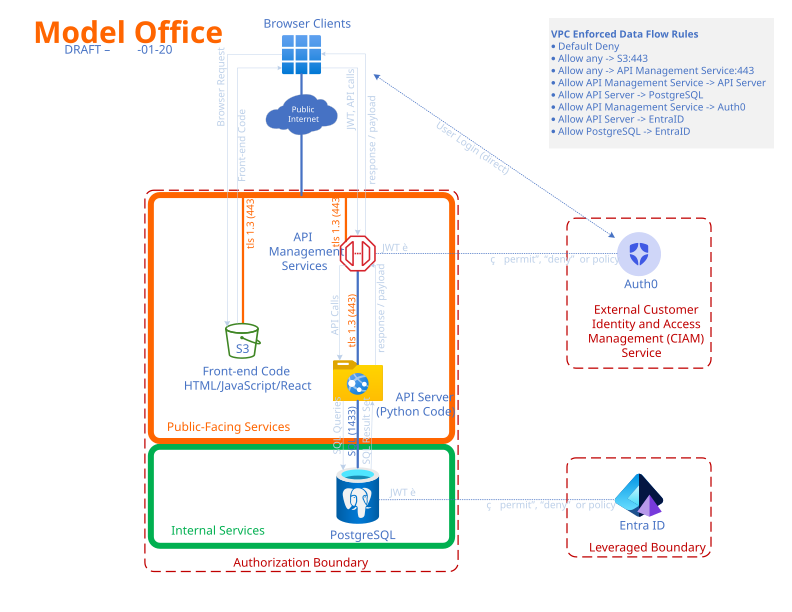

# System Security Plan (SSP)

## OSCAL Model: System Security Plan

The **System Security Plan (SSP)** model documents the system's security posture, including the system's authorization boundary, architecture, data flows, and detailed descriptions of how each control is implemented.

### About the Summit System

**Summit** is a fictitious cloud-based information system operated by **Oscalate Systems**. It is hosted in AWS and provides a public-facing web application consisting of a static front end with an API backend that serves public customers.

**Key characteristics:**

- **Cloud Provider:** Amazon Web Services (AWS)
- **Architecture:** Static front end + API backend
- **Customer Authentication:** Auth0
- **Privileged Access:** Microsoft Entra ID
- **Audience:** Public customers of Oscalate Systems

### View the SSP

View the Summit SSP interactively using the OSCAL Viewer:

[**View Summit SSP in OSCAL Viewer**](https://viewer.oscal.io/system-security-plans/?url=https%3A%2F%2Fraw.githubusercontent.com%2FOSCAL-Foundation%2FPattern-Library%2Fmain%2Fsummit%2Fsystem-security-plan%2Fsummit_system_ssp.json)

### System Diagrams

**Technical Architecture**

**Authorization Boundary**

### What Belongs Here

- OSCAL SSP files (JSON)
- System characteristics and authorization boundary definitions
- Control implementation descriptions

### Key Concepts

- **System Characteristics**: Description of the system including boundary, status, and information types
- **System Implementation**: Inventory of components, users, and services
- **Control Implementation**: Detailed narratives for each applicable control
- **Import Profile**: Reference to the profile (baseline) that defines applicable controls
- **Responsible Roles**: Parties responsible for control implementation

### OSCAL Reference

- [OSCAL SSP Model Documentation](https://pages.nist.gov/OSCAL/reference/latest/system-security-plan/json-outline/)
- [OSCAL SSP Tutorial](https://pages.nist.gov/OSCAL/learn/tutorials/ssp/)
